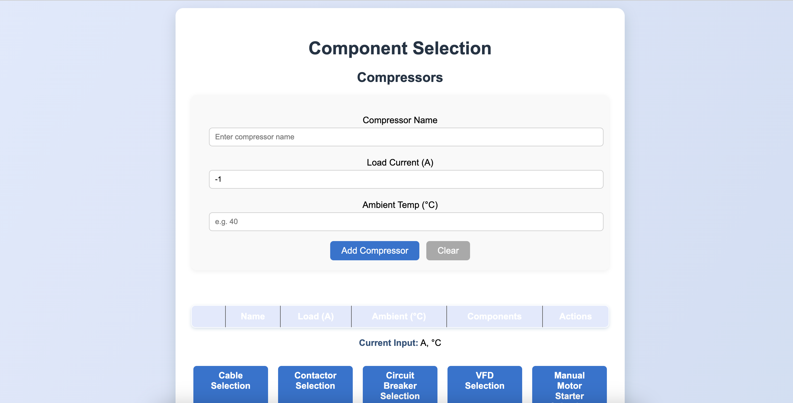
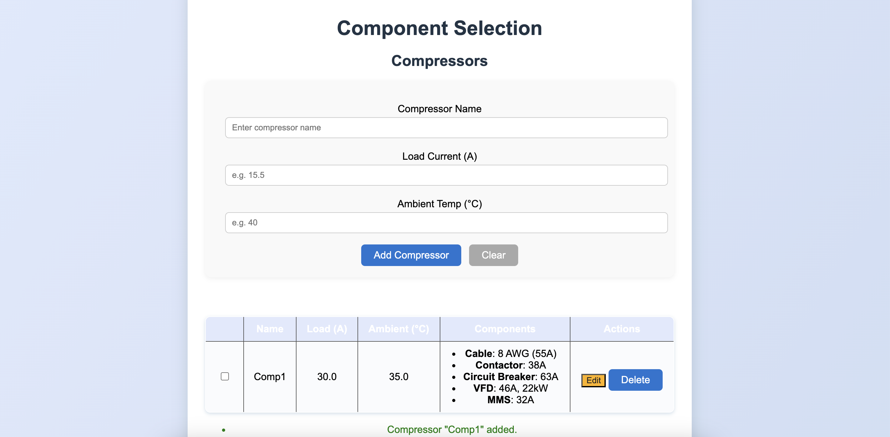
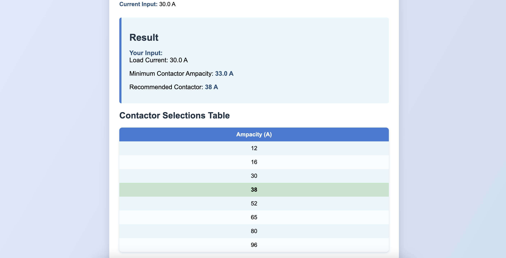

At an HVAC company, I worked on a component selection project that focused on streamlining the process of identifying and choosing electrical components for HVAC and power systems. The goal was to reduce waste, improve efficiency, and ensure reliability in design. I built a Python Flask tool that allowed engineers to input project requirements such as voltage, current, and length specifications and automatically generated optimized lists of wires, cables, and other parts. The system also tracked available inventory, calculated leftover lengths, and suggested the best way to minimize unused material. This project improved accuracy and consistency in the selection process while saving both time and resources by reducing manual calculations and errors.

By Firas Khalifa

